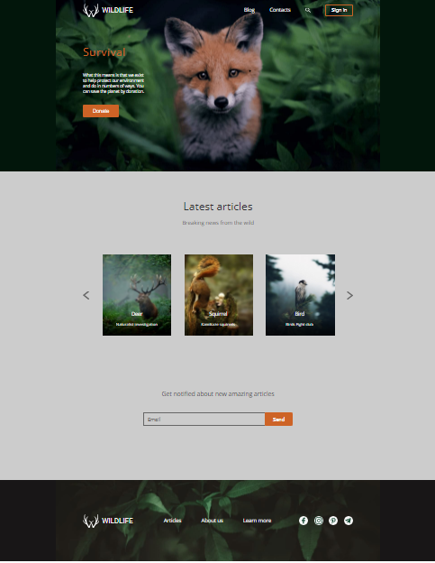

**Wildlife**

1. Task link: https://rolling-scopes-school.github.io/stage0/#/tasks/wildlife
2. Screenshot wildlife task:\

3. Link of deploy (netlify/gh-pages) according docs.rs.school
4. Done 03.03.2021 / Deadline: 15.03.2021
5. **Score**: 50 / 50; \
  5.1. Блок Header +10; \
  5.2. Блок Survival +10; \
  5.3. Блок Latest articles +10; \
  5.4. Блок Get notified +10; \
  5.5. Блок Footer +10; 
6. Youtube link (only for cross-check tasks) *(self-estimation)*
7. During development all **commits** were creating in **master** branch \
https://github.com/AlexandrDrozdFD/wildlife/commits/master
8. Screen of submit